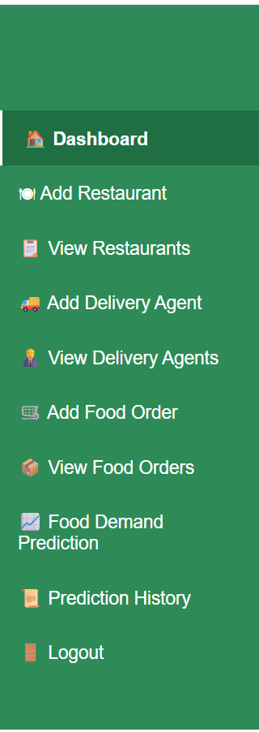

# Smart Food Demand Prediction System
## Dashboard



A web-based Food Demand Prediction and Management System developed using Python, Flask, SQLite, HTML, CSS, and Machine Learning concepts.

## Project Overview

The Smart Food Demand Prediction System helps manage restaurants, delivery agents, food orders, and food demand predictions through a simple web application.

The system provides a dashboard to monitor food orders and prediction results and maintains a history of previous predictions.

## Features

- User Registration and Login
- Dashboard with summary information
- Add and View Restaurants
- Add and View Delivery Agents
- Add and View Food Orders
- Search and Filter Food Orders
- Sort Food Orders
- Edit and Delete Food Orders
- Food Demand Prediction
- Prediction History
- Search Prediction History
- Edit Prediction History
- SQLite Database Integration
- Responsive Web Interface

## Technologies Used

- Python
- Flask
- SQLite
- HTML
- CSS
- Jinja2
- Git
- GitHub

## Project Structure

```text
SmartFoodDemandAI
│
├── app.py
├── README.md
├── .gitignore
│
├── static
│   └── css
│       └── style.css
│
└── templates
    ├── dashboard.html
    ├── login.html
    ├── register.html
    ├── prediction.html
    ├── prediction_history.html
    ├── add_food_order.html
    ├── view_food_orders.html
    ├── add_restaurant.html
    ├── view_restaurants.html
    ├── add_delivery_agent.html
    └── view_delivery_agents.html